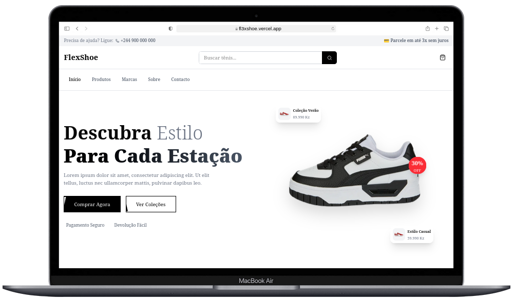
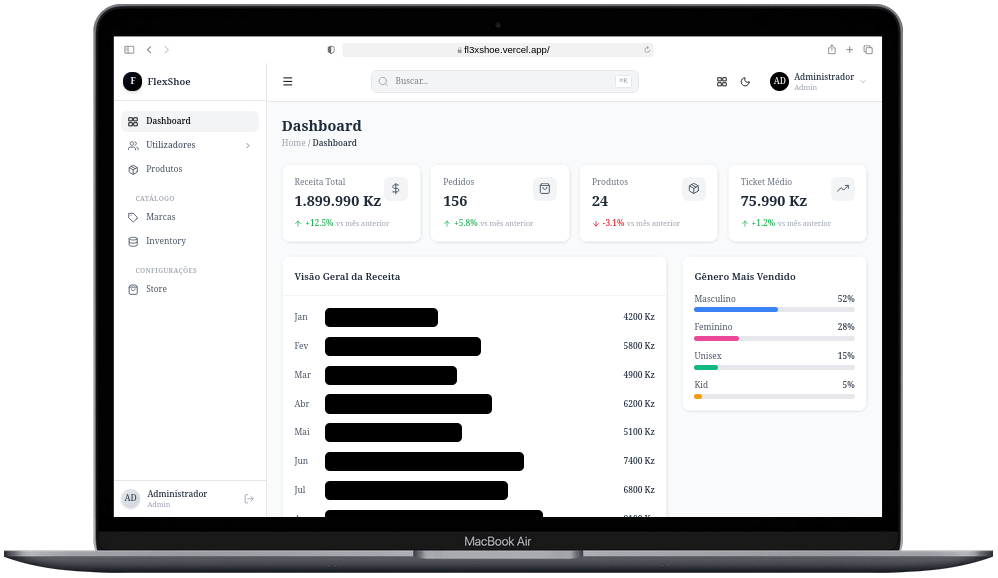

<div align="center">
   
  </br> </br>
  
  [](https://github.com/Adyllsxn/flexshoe)
  [](https://flexshoe.vercel.app)
  [](docs/Setup.md)
  [](LICENSE)

</div>

---

## **📖 SOBRE O PROJETO**

> O **FlexShoe** é um e-commerce moderno de tênis desenvolvido para oferecer uma experiência de compra rápida e intuitiva, com finalização de pedidos integrada ao WhatsApp. Ideal para pequenos e médios vendedores que desejam digitalizar suas vendas sem complicações.

### **✨ Funcionalidades:**
```markdown
✅ Carrinho de compras com persistência local
✅ Checkout otimizado em poucos cliques
✅ Finalização de pedidos via WhatsApp
✅ Catálogo dinâmico de produtos
✅ Interface responsiva (PC, tablet e smartphone)
✅ Sistema open-source para lojistas
```

### **🔧 Fluxo da Aplicação**
> Usuário navega → Adiciona ao carrinho → Finaliza compra → Pedido enviado via WhatsApp

---

## **🛠️ TECNOLOGIAS**

| Camada | Tecnologias |
|--------|-------------|
| **Backend** | NestJS, Node.js, Prisma, PostgreSQL, JWT |
| **Frontend** | Next.js, React, TailwindCSS, Zustand |
| **Integrações** | WhatsApp Business API, Vercel |
| **Infra** | Docker, Git, GitHub Actions |

---


## **📸 DEMO**
<div align="center">
  <table>
    <tr>
      <td align="center" width="50%">
        
        <br />
        <b>🎨 Loja (Cliente)</b>
        <br /><br />
        <b>🔗 Links:</b><br />
        <a href="http://localhost:3000/">🌐 Local: http://localhost:3000/</a><br />
        <a href="https://fl3xshoe.vercel.app">🚀 Remoto: https://fl3xshoe.vercel.app</a>
      </td>
      <td align="center" width="50%">
        
        <br />
        <b>⚙️ Painel Administrativo</b>
        <br /><br />
        <b>🔗 Links:</b><br />
        <a href="http://localhost:3000/admin">🌐 Local: http://localhost:3000/admin</a><br />
        <a href="https://fl3xshoe.vercel.app/admin">🚀 Remoto: https://fl3xshoe.vercel.app/admin</a>
      </td>
    </tr>
  </table>
</div>

---

## **🔌 INTEGRAÇÃO COM API**

> O projeto já possui integração completa com a API backend. Para testar localmente, basta clonar o repositório, configurar o backend e executar ambos os servidores.

---

## **📄 LICENÇA**

> Este projeto está sob a licença MIT, o que significa que é de código aberto e pode ser utilizado livremente para fins académicos e comerciais, desde que mantidos os créditos.


```markdown
📚 Código aberto (open source)
✅ Livre para uso académico
🤝 Contribuições são bem-vindas
```